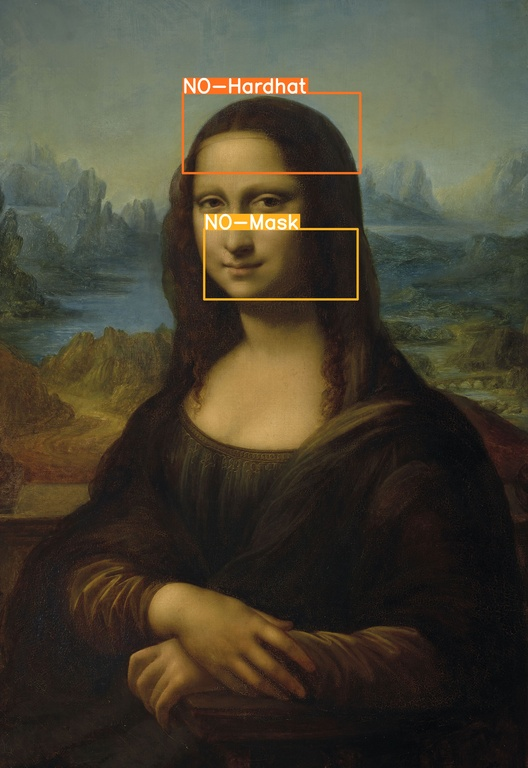

# SafetyArt
Object detection for construction sites coupled with master paintings powered by Yolov8.



# HOW TO USE

### create your environnement & install dependencies
```
 $ python3 -m virtualenv ~/SafetyArtEnv
 $ source ~/SafetyArtEnv/bin/activate
 $ pip install -r requirements.txt

``` 

### how to launch
add some pictures in the folder data/ and launch the script.

```
 $ python3 detect.py
```

the result will be saved into the folder data/detect/predict*.

### Source
 - The model come from https://github.com/snehilsanyal/Construction-Site-Safety-PPE-Detection

### Build a video with the result

```
  $ ffmpeg -framerate 1/10 -pattern_type glob -i '*.jpg' -filter_complex "scale=1920:1080:force_original_aspect_ratio=decrease,pad=1920:1080:(ow-iw)/2:(oh-ih)/2" -pix_fmt yuv420p -r 30 outputvideo.mp4
```